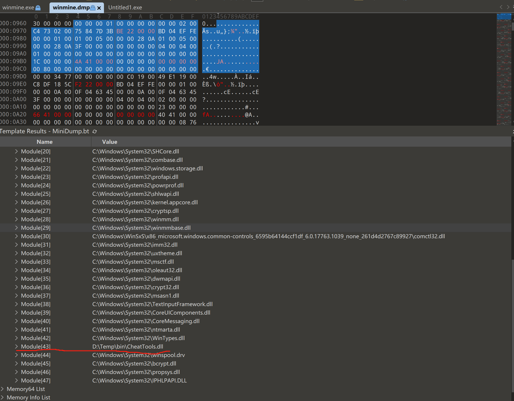

# ring3扫雷

初赛ring3题目：
winmine.exe是一个扫雷游戏程序，winmine.dmp是该程序的一份进程dump, 在这份dump中，winmine.exe的内存映像有指令被篡改，篡改实现了外挂功能。

1. 请找出dump中，winmine.exe的内存映像中2处被篡改实现外挂功能的指令（被篡改指令的偏移、篡改前后的指令分别是什么），并分析这些指令篡改所实现的外挂功能是什么。（4分）
    - 停止计时
        
        01002FF5        | FF05 9C570001          | inc dword ptr ds:[100579C]              |
        
        被nop掉
        
        原本片段
        
        ```nasm
        01002FE0        | 833D 64510001 00       | cmp dword ptr ds:[1005164],0            |
        01002FE7        | 74 1E                  | je winmine.1003007                      |
        01002FE9        | 813D 9C570001 E7030000 | cmp dword ptr ds:[100579C],3E7          |
        01002FF3        | 7D 12                  | jge winmine.1003007                     |
        01002FF5        | FF05 9C570001          | inc dword ptr ds:[100579C]              |
        01002FFB        | E8 B5F8FFFF            | call winmine.10028B5                    |
        ```
        
        原本计时功能：总时间3e7的倒计时（999），即使到了999也不会停止游戏，只是UI上计时的地方一直显示999
        
        nop后将不会计时，时间一直维持在1
        
    - 遇雷不爆
        
        01003591              | 6A 00                  | push 0                                                            | 
        
        改成
        
        01003591                 | EB 1D                  | jmp winmine.10035B0                                               |
        
        遇到雷的时候因为push 0改成jmp winmine.10035B0直接跳过爆雷的处理
        
        修改后的片段
        
        ```nasm
        01003591              | EB 1D                  | jmp winmine无敌.10035B0                                             |
        **01003593              | EB 16                  | jmp winmine无敌.10035AB                                             |
        01003595              | 50                     | push eax                                                          |
        01003596              | 56                     | push esi                                                          |
        01003597              | E8 E8FAFFFF            | call winmine无敌.1003084                                            |
        0100359C              | A1 A4570001            | mov eax,dword ptr ds:[10057A4]                                    |
        010035A1              | 3B05 A0570001          | cmp eax,dword ptr ds:[10057A0]                                    |
        010035A7              | 75 07                  | jne winmine无敌.10035B0                                             |
        010035A9              | 6A 01                  | push 1                                                            |
        010035AB              | E8 CCFEFFFF            | call winmine无敌.100347C**                                            |
        010035B0              | 5F                     | pop edi                                                           |
        010035B1              | 5E                     | pop esi                                                           |
        010035B2              | 5D                     | pop ebp                                                           |
        010035B3              | 5B                     | pop ebx                                                           |
        010035B4              | C2 0800                | ret 8                                                             |
        ```
        

1. 请提供文档，详细描述解题过程，如涉及编写程序，必须提供源代码。（1分）
    1. 010 editor找到exe文件的.text区段A，在.dmp中找.text区段A’
    2. 两个区段.text的开头部分不同，但是因为在x64dbg中发现前面部分不影响扫雷的效果，而且太大一段了不太像是作弊修改的代码所以暂时忽略。忽略开头，发现有两处不一样
    3. 直接修改winmine.exe中对应两处验证构成winmine无敌.exe，有了大概猜想的功能（停止计时和遇雷不爆）
    4. xdbg调试winmine.exe，发现一处修改对应停止计时，一处修改对应遇雷不爆

复赛ring3题目：（本题共5分）
winmine.exe是一个扫雷游戏程序，winmine.dmp是该程序的一份进程dump, 在这份dump中，有一个DLL作弊程序。

1. 请找到该作弊程序，给出模块名；（1分）
    
    
    
    因为说了是.dll程序，所以在010中看了下module list，看到一个疑似作弊.dll的程序：CheatTools.dll
    
    windbg查看模块详细信息
    
    
    
    通过上面的信息（AddressOfEntryPoint）在winmine.dmp中找到了cheattools.dll的header以及后续.text(code)和.data+.rdata(InitializedData），复制出来得到cheattools.dll或者windbg中
    
    ```nasm
    .writemem C:\CheatTools.dll 6e220000 6e266000-1
    ```
    
    直接获得cheattools.dll
    
    相互验证了一下，两种方法得到的CheatTools.dll是一样的
    

    修改cheattools.dll一些属性（pointertorawdata）
    
    修改后
    
    

2. 并分析它所包含的4个作弊功能，给出实现作弊功能的函数的偏移，并说明其作弊功能是什么。（4分）
    
    IDA分析CheatTools.dll发现有大量MFC函数，所以用resource hacker分析MFC部分，发现作弊的Dialog及对应的4个作弊功能：暂停时间，遇雷不爆，一键游戏，地雷分布
    
    
    
    - 暂停时间
        
        因为我们已经知道CheatTools.dll会对winmine.exe的内容进行修改，而winmine.exe的地址是0x100xxxx，所以在IDA中搜索匹配100的内容碰一下运气
        
        
        
        发现是有相关内容的，就挨个点进去查看
        
        发现sub_6E221660应该就是暂停时间的函数，因为修改winmine.exe的内容有调用VirtualProtect，并且我们已知暂停时间是nop 1002ff5h位置size=6的命令
        
        ```nasm
        .text:6E221660 sub_6E221660    proc near               ; DATA XREF: .rdata:6E24EEDC↓o
        .text:6E221660
        .text:6E221660 flOldProtect    = dword ptr -4
        .text:6E221660
        .text:6E221660                 push    ecx
        .text:6E221661                 push    esi
        .text:6E221662                 push    edi
        **.text:6E221663                 mov     edi, ds:VirtualProtect**
        .text:6E221669                 lea     eax, [esp+0Ch+flOldProtect]
        .text:6E22166D                 push    eax             ; lpflOldProtect
        .text:6E22166E                 push    40h ; '@'       ; flNewProtect
        .text:6E221670                 push    6               ; dwSize
        .text:6E221672                 push    1002FF5h        ; lpAddress
        .text:6E221677                 mov     esi, ecx
        **.text:6E221679                 call    edi ; VirtualProtect
        .text:6E22167B                 mov     eax, 90909090h
        .text:6E221680                 mov     ecx, 1002FF5h**
        **.text:6E221685                 mov     [ecx], eax
        .text:6E221687                 mov     [ecx+4], ax**
        **.text:6E22168B                 mov     edx, [esp+0Ch+flOldProtect]
        .text:6E22168F                 lea     ecx, [esp+0Ch+flOldProtect]
        .text:6E221693                 push    ecx             ; lpflOldProtect
        .text:6E221694                 push    edx             ; flNewProtect
        .text:6E221695                 push    6               ; dwSize
        .text:6E221697                 push    1002FF5h        ; lpAddress
        .text:6E22169C                 call    edi ; VirtualProtect**
        .text:6E22169E                 push    offset a0xc8    ; "0xC8"
        .text:6E2216A3                 lea     ecx, [esi+0C8h] ; this
        .text:6E2216A9                 call    ?SetWindowTextA@CWnd@@QAEXPBD@Z ; CWnd::SetWindowTextA(char const *)
        .text:6E2216AE                 push    offset a0x1002ff5 ; "0x1002FF5"
        .text:6E2216B3                 lea     ecx, [esi+11Ch] ; this
        .text:6E2216B9                 call    ?SetWindowTextA@CWnd@@QAEXPBD@Z ; CWnd::SetWindowTextA(char const *)
        .text:6E2216BE                 mov     ecx, esi
        .text:6E2216C0                 call    sub_6E2213B0
        .text:6E2216C5                 pop     edi
        .text:6E2216C6                 pop     esi
        .text:6E2216C7                 pop     ecx
        .text:6E2216C8                 retn
        .text:6E2216C8 sub_6E221660    endp
        ```
        
        ImageBase：6E220000
        
        暂停时间作弊地址：6E221660
        
        偏移：1660
        
    - 遇雷不爆
        
        同理，在搜索匹配100的内容中继续往下找
        
        发现sub_6E2216D0应该就是遇雷不爆的函数，把1003591h位置的命令换成EB 1D 
        
        ```nasm
        .text:6E2216D0 sub_6E2216D0    proc near               ; DATA XREF: .rdata:6E24EEF4↓o
        .text:6E2216D0
        .text:6E2216D0 var_8           = word ptr -8
        .text:6E2216D0 flOldProtect    = dword ptr -4
        .text:6E2216D0
        .text:6E2216D0                 sub     esp, 8
        .text:6E2216D3                 push    esi
        .text:6E2216D4                 push    edi
        **.text:6E2216D5                 mov     edi, ds:VirtualProtect**
        .text:6E2216DB                 lea     eax, [esp+10h+flOldProtect]
        .text:6E2216DF                 push    eax             ; lpflOldProtect
        .text:6E2216E0                 push    40h ; '@'       ; flNewProtect
        .text:6E2216E2                 push    4               ; dwSize
        .text:6E2216E4                 push    1003591h        ; lpAddress
        .text:6E2216E9                 mov     esi, ecx
        **.text:6E2216EB                 call    edi ; VirtualProtect
        .text:6E2216ED                 mov     byte ptr [esp+10h+var_8], 0EBh
        .text:6E2216F2                 mov     byte ptr [esp+10h+var_8+1], 1Dh
        .text:6E2216F7                 mov     cx, [esp+10h+var_8]
        .text:6E2216FC                 lea     edx, [esp+10h+flOldProtect]
        .text:6E221700                 push    edx             ; lpflOldProtect
        .text:6E221701                 mov     ds:1003591h, cx
        .text:6E221708                 mov     eax, [esp+14h+flOldProtect]
        .text:6E22170C                 push    eax             ; flNewProtect
        .text:6E22170D                 push    4               ; dwSize
        .text:6E22170F                 push    1003591h        ; lpAddress
        .text:6E221714                 call    edi ; VirtualProtect**
        .text:6E221716                 push    offset a0xc8    ; "0xC8"
        .text:6E22171B                 lea     ecx, [esi+0C8h] ; this
        .text:6E221721                 call    ?SetWindowTextA@CWnd@@QAEXPBD@Z ; CWnd::SetWindowTextA(char const *)
        .text:6E221726                 push    offset a0x1003591 ; "0x1003591"
        .text:6E22172B                 lea     ecx, [esi+11Ch] ; this
        .text:6E221731                 call    ?SetWindowTextA@CWnd@@QAEXPBD@Z ; CWnd::SetWindowTextA(char const *)
        .text:6E221736                 mov     ecx, esi
        .text:6E221738                 call    sub_6E2213B0
        .text:6E22173D                 pop     edi
        .text:6E22173E                 pop     esi
        .text:6E22173F                 add     esp, 8
        .text:6E221742                 retn
        .text:6E221742 sub_6E2216D0    endp
        ```
        
        ImageBase：6E220000
        
        暂停时间作弊地址：6E2216D0 
        
        偏移：16D0
        
    - 一键游戏（显示非雷的所有内容）
        
        之前xdbg调试winmine.exe发现：
        
        1. winmine.1003008根据push的x和y显示这一格的内容（深色/（数字/雷））
        2. winmine.1003084调用winmine.1003008，winmine.1003084显示整片安全区或者单个数字或雷
        3. winmine.1003512调用winmine.1003084，winmine.1003512是点击格子的整个流程，判断点击的格子是已经显示过的还是未显示过的，未显示过的则判断对应安全区还是雷，显示对应内容并进行逻辑判断（比如是雷就爆）
        4. winmine.10037E1调用winmine.1003512，winmine.10037E1是整个点击流程，包括判读那如果是最开始的点击则设置timer计时，显示图像（1003512）和bgm配合
        5. ds:[1005334] 和 ds:[1005338]  存的棋盘边界，防止越界，目前是（9，9）
        6. ds:[01005340]开始储存棋盘，已知（x，y），ds: [y左移5位（y*32）+ x +1005340]（byte）对应这一格的内容。如果是0x8F则是地雷
        
        然后，在搜索匹配100的内容中继续往下找
        
        发现sub_6E221820应该就是一键游戏的函数，两个for循环遍历整个棋盘，如果不是地雷则调用winmine.1003512点击这个格子
        
        ```cpp
        void **sub_6E221820**()
        {
          ...
          MEMORY[0x1003512](1, 1);
          v29 = MEMORY[0x1005334];
          v30 = MEMORY[0x1005338];
          v0 = MEMORY[0x1005338] * MEMORY[0x1005334] + 16798828;
          v1 = (void ***)operator new(4u);
          if ( v1 )
            *v1 = &v24;
          else
            v1 = 0;
          v24 = v1;
          v2 = 0;
          v3 = 0;
          v4 = 0;
          v25 = 0;
          v26 = 0;
          v27 = 0;
          v5 = 16798528;
          v35 = 1;
          for ( i = 16798528; v5 < v0; i = v5 )
          {
            **if ( *(_BYTE *)v5 == 0x8F )  //判断是不是地雷**
            {
              ...
            }
            ++v5;
          }
        ...
          v17 = 1;
          **for ( k = 1; v17 <= v30; k = v17 )
          {
            v18 = v29;
            v19 = 1;
            for ( i = 1; v19 <= v18; i = v19 )
            {
              if ( !(unsigned __int8)sub_6E221750(v20, v17, v19) )  //如果不是雷
                MEMORY[0x1003512](i, k);
              ++v19;
            }
            ++v17;
          }**
          ...
        }
        ```
        
        ImageBase：6E220000
        
        一键游戏作弊地址：6E221820
        
        偏移：1820
    - 地雷分布
        
        继续查找CheatTools.dll .text中所有包含100xxxxh的命令
        
        发现sub_6E221AC0应该是发现地雷分布的方法，两个for循环遍历棋盘，如果是雷则显示位置
        
        ```cpp
        void __thiscall **sub_6E221AC0**(CWnd *this)
        {
         ...
          v30 = this;
          v32 = MEMORY[0x1005334];
          v29 = MEMORY[0x1005338];
          v1 = MEMORY[0x1005338] * MEMORY[0x1005334] + 16798828;
          v2 = (void ***)operator new(4u);
          if ( v2 )
            *v2 = &v35;
          else
            v2 = 0;
          v35 = v2;
          v3 = 0;
          v4 = 0;
          v5 = 0;
          v36 = 0;
          v37 = 0;
          v38 = 0;
          v6 = 16798528;
          v43 = 1;
          for ( i = (char *)16798528; v6 < v1; i = (char *)v6 )
          {
            if ( *(_BYTE *)v6 == 0x8F )  //如果是地雷
            {
              ...
            }
            ++v6;
          }
          ...
          **for ( k = 1; k <= v29; ++k )
          {
            v21 = v32;
            for ( l = 1; l <= v21; ++l )
            {
              if ( (unsigned __int8)sub_6E221750(v39, k, l) == 1 )   //如果是雷就显示
              {
                sub_6E223040((int)&String, (char *)&byte_6E24EFDC, k);
                sub_6E222080("\n", 1u);
                sub_6E222080(String, *((_DWORD *)String - 3));
              }
            }
          }**
          ...
        }
        ```
        
        ImageBase：6E220000
        
        地雷分布作弊地址：6E221AC0
        
        偏移：1AC0
